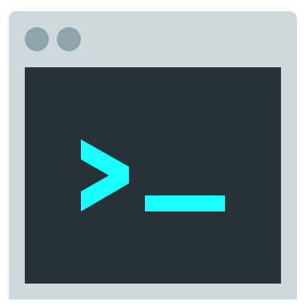

<div style="text-align:center">
<h1>MPPM 👨‍💻</h1>

</br>
<a href="https://github.com/Jamalianpour/mppm/licence">
    
</a>
<a>
    
</a>
<a>
    
</a>
<a>
    
</a>

</div>

## What is MPPM?

When you turn on your PC and you want to working on a project, some time need to open and start some application for example IDE, browser, ssh client and etc. so MPPM can help you. 😁   
MPPM is a simple cli to speed up your development tools startup, with one command you can open all of the tools that you need to start programming and developing your project like some IDE, Database tools, open browser with multi tab and etc.

## Installation

There is two way to install MPPM:

### 1. Direct download

Download binary file (Lastest version: 0.2.4) for your OS from [release page](https://github.com/jamalianpour). (windows, linux, mac)
Don't forget add MPPM binary to your system path.

### 2. Clone project

At first clone project:

```sh
git clone https://github.com/spf13/cobra.git
```

go to the project folder `cd mppm` and now build your binary and use that:

```sh
go install
```

_note: for this way Golang should be installed on system. [install link](https://golang.org/doc/install)_


## Usage

Now you can use `mppm help` to see available Commands:

```sh
> mppm help

//output
A simple cli to speed up your development tools startup,
with one command you can open all of the tools that you need to
start programming and developing your project like some IDE, Database tools and etc

enjoy it and have fun 👍

Usage:
  mppm [flags]
  mppm [command]

Available Commands:
  add         Add command to your project
  create      Create new project
  delete      Delete a command of project
  help        Help about any command
  info        Show all Command and detail of a project
  remove      Remove a project and all of related data
  run         Run and execute project commands
  show        Show all project in mppm

Flags:
  -h, --help      help for mppm
  -v, --version   Show mppm version

Use "mppm [command] --help" for more information about a command.
```

### Create new project

First things first we need to create a project with cearte command:

```sh
> mppm cearte test

//output
test created successfully 🎉

Now add command to project with 'mppm add [ProjectName] --command=***'
Use "mppm add --help" for more information about this command.
```

### Add command to project

After create project you can add your command to that with `mppm add [ProjectName]` Command, and `--command`, `--path` Flags.

##### --command

use this flag to set your command. shortly you can use `-C`

##### --path

use this flag to set path you want to your command run at that. shortly you can use `-P`

```sh
> mppm add test -C "code ." -P "/home/user/project1"
> mppm add test -C "code ." -P "/home/user/project2"

//output
New command add to project successfully 🎉
```

### Run project

When create project and add command(s) to that now it's ready to use with `mppm run [ProjectName]` Command.

```sh
> mppm run test
```

It's done now enjoy it.

### Other Commands

#### Show

Show command will show all projects created in mppm.

```sh
mppm show

//output
 ____________________________________
|List of all project created in mppm:|
|1. test                             |
|2. test2                            |
|3. test3                            |
|4. test4                            |
|____________________________________|
```

#### Info

Info command will show all data about a project.

```sh
> mppm info test

//output
Name: test
--------------- Command  0 ---------------
Path: /home/user/project1
Command: code .
--------------- Command  1 ---------------
Path: /home/user/project2
Command: code .
```

#### Delete
Delete command will delete a command in project. with `--command` or `-c`  you can select index of command you want to delete.

```sh
> mppm delete test -c 0

//output
--------------- Command 0 ---------------
Path: /home/user/project1
Command: code .
--------------- Command 1 ---------------
Path: /home/user/project2
Command: code .

Do you want to delete command 0 ? y

Deleted successfully
```

#### Remove

Remove commad will remove a project and all of related data.

```sh
> mppm remove test

//output
Are you sure? y
```


## Example
Please at first read all above document and create a project with `create` command then read this part.

#### Visual studio code
To open a project in vscode first create a project and then add this command:
```sh
> mppm add myProject -c "code ." -p "/path/to/project"
```

#### Visual studio
```sh
> mppm add myProject -c "start devenv" -p "/path/to/project/project.sln"
```

#### Intellij
If you add intellij bin folder to your system path you can use this:
```sh
> mppm add myProject -c "idea(.exe) /path/to/project" -p "/"
```

#### Open browser
##### windows
```sh
> mppm add myProject -c "start firefox/chrome google.com,site2.com,site3.com" -p "/"
```
##### Linux
```sh
> mppm add myProject -c "firefox/chrome google.com,site2.com,site3.com" -p "/"
```

#### ssh Client
##### Windows
In this case I use putty:
```sh
> mppm add myProject -c "putty.exe -ssh root@x.x.x.x" -p "/"
```
##### Linux
```sh
> mppm add myproject -c "gnome-terminal -e \"ssh root@x.x.x.x\"" -p "/"
```

---
If see any problem or bug in MPPM open issue and tell me.   
Feel free to fork this repository and send pull request 🏁👍
